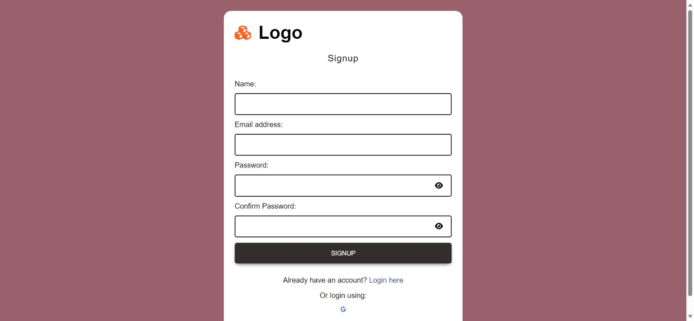

# This project is made during the learning stage of React which contains:

## 1. Basic react codes
### 1.1. UseState

### 1.2. UseEffect

## 2. Resturant Menu

## 3. Login and Sign up Form

## 4. Netflix Clone

## 5. OOP codes

## 6. Pokemon App with realtime API data

## 7. Food Recipe App with API

